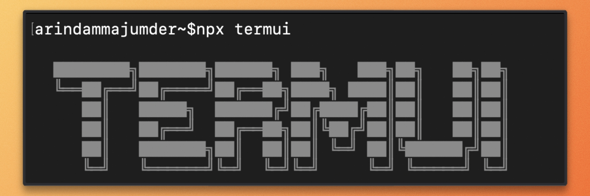
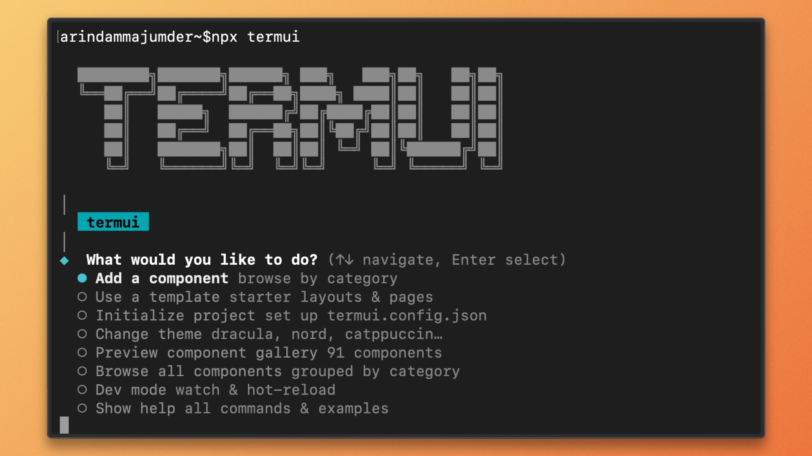

<div align="center">

# TermUI

**Build beautiful terminal interfaces with React components you actually own.**

[](https://github.com/Arindam200/termui/actions)
[](https://www.npmjs.com/package/termui)
[](https://opensource.org/licenses/MIT)

[Quick Start](#quick-start) &bull; [Components](#components-v114-101-components) &bull; [Theming](#theming) &bull; [CLI](#cli) &bull; [Docs](./docs)

</div>

---

TermUI is a comprehensive terminal UI framework for TypeScript, with **101 components**, **8 themes**, **12 hooks**, and a shadcn-style CLI that copies source code directly into your project. No black-box dependency. No version lock-in. Just code you own and can customize.

```bash
npx termui add spinner table select alert
```

### Why TermUI?

The terminal UI landscape in JavaScript is stuck. **Ink** gives you 5 primitives and leaves the rest to you. **Blessed** hasn't seen a commit in years. Neither offers a component library with real breadth (charts, forms, data grids, templates), and nothing gives you shadcn-style distribution where you own every line.

TermUI fills that gap:

- **101 production-ready components:** from `Spinner` and `Table` to `LineChart`, `DataGrid`, `LoginFlow`, and `QRCode`
- **Copy-paste distribution:** `npx termui add` drops source files into your project; no runtime dependency on the registry
- **Themeable everything:** swap between Dracula, Nord, Catppuccin, and 5 more with a single command, or create your own
- **React mental model:** if you know React, you already know TermUI; it's JSX, hooks, and flexbox all the way down
- **Built-in testing:** `@termui/testing` gives you `renderToString`, `fireEvent`, and `waitFor` for headless component tests

---

## Quick Start

```bash
# Launch the interactive menu
npx termui

# Or use commands directly
npx termui init
npx termui add spinner
npx termui add table select alert
npx termui list
```

### Your first TermUI app

```tsx
import React from 'react';
import { render } from 'ink';
import { ThemeProvider } from '@termui/core';
import { Spinner, ProgressBar, Alert, Select } from '@termui/components';

function App() {
  return (
    <ThemeProvider>
      <Spinner style="dots" label="Loading…" />
      <ProgressBar value={72} total={100} label="Installing…" />
      <Alert variant="success" title="Done!">
        Your app is ready.
      </Alert>
      <Select
        options={[
          { value: 'npm', label: 'npm' },
          { value: 'pnpm', label: 'pnpm' },
          { value: 'bun', label: 'bun' },
        ]}
        onSubmit={(val) => console.log('Selected:', val)}
      />
    </ThemeProvider>
  );
}

render(<App />);
```

---

## Components (v1.1.4, 101 components)

| Category   | Components                                                                                                           |
| ---------- | -------------------------------------------------------------------------------------------------------------------- |
| Layout     | `Box` `Stack` `Grid` `ScrollView`                                                                                    |
| Typography | `Text` `Badge` + more                                                                                                |
| Input      | `TextInput` + more                                                                                                   |
| Selection  | `Select` `Checkbox` `MultiSelect` + more                                                                             |
| Data       | `List` `Table` `DataGrid` + more                                                                                     |
| Feedback   | `Spinner` `ProgressBar` `Alert` + more                                                                               |
| Navigation | `Tabs` + more                                                                                                        |
| Overlays   | `Modal` + more                                                                                                       |
| Forms      | `Form` `Wizard` `TimePicker` + more                                                                                  |
| Charts     | `Sparkline` `BarChart` `LineChart` `PieChart` `HeatMap` `Gauge`                                                      |
| Utility    | `Timer` `Stopwatch` `Clock` `Clipboard` `KeyboardShortcuts` `Help` `ErrorBoundary` `Log` `QRCode` `Image`            |
| Templates  | `SplashScreen` `InfoBox` `BulletList` `AppShell` `WelcomeScreen` `LoginFlow` `UsageMonitor` `SetupFlow` `HelpScreen` |

Browse everything: `npx termui list` or `npx termui preview`

---

## CLI

`npx termui` with no arguments launches a full interactive menu:




| Command                         | Description                               |
| ------------------------------- | ----------------------------------------- |
| `npx termui`                    | Interactive menu                          |
| `npx termui init`               | Initialize TermUI in your project         |
| `npx termui add <component>`    | Add one or more components                |
| `npx termui add --all`          | Add all 101 components at once            |
| `npx termui update <component>` | Re-download a component from the registry |
| `npx termui list`               | Browse all available components           |
| `npx termui diff <component>`   | Show diff vs registry version             |
| `npx termui theme [name]`       | List or apply a theme                     |
| `npx termui preview`            | Interactive component gallery             |
| `npx termui dev`                | Watch mode: hot-reload on file change    |

---

## Theming

TermUI ships 8 built-in themes.

```bash
npx termui theme dracula
npx termui theme nord
npx termui theme catppuccin
```

| Theme         | Description                     |
| ------------- | ------------------------------- |
| `default`     | Clean, neutral palette          |
| `dracula`     | Dark purple with vibrant colors |
| `nord`        | Arctic, north-bluish palette    |
| `catppuccin`  | Soothing pastel mocha tones     |
| `monokai`     | Classic warm dark theme         |
| `tokyo-night` | Vibrant neon city               |
| `one-dark`    | Atom-inspired dark              |
| `solarized`   | Ethan Schoonover classic        |

Or use a theme programmatically:

```tsx
import { ThemeProvider, draculaTheme } from '@termui/core';

<ThemeProvider theme={draculaTheme}>
  <App />
</ThemeProvider>;
```

### Custom theme

```tsx
import { createTheme } from '@termui/core';

const myTheme = createTheme({
  name: 'my-brand',
  colors: {
    primary: '#FF6B6B',
    focusRing: '#FF6B6B',
  },
});
```

---

## Hooks

```ts
import {
  useInput,        // keyboard input
  useFocus,        // component focus state
  useFocusManager, // programmatic focus
  useTheme,        // access theme tokens
  useTerminal,     // cols, rows, color depth
  useAnimation,    // frame-based animation
  useInterval,     // safe setInterval
  useClipboard,    // OSC 52 clipboard
  useKeymap,       // declarative keybindings
  useMouse,        // mouse events
  useResize,       // terminal resize
  useAsync,        // async data loading
} from '@termui/core';
```

---

## Testing

`@termui/testing` provides headless testing utilities for TermUI components:

```ts
import { renderToString, screen, waitFor, fireEvent } from '@termui/testing';

const output = await renderToString(<Spinner style="dots" />);
expect(screen.hasText('⠋', output)).toBe(true);
```

| Export               | Description                                             |
| -------------------- | ------------------------------------------------------- |
| `renderToString`     | Render a component to a plain string (one frame)        |
| `createTestRenderer` | Reusable renderer with `render` / `cleanup`             |
| `screen`             | Query helpers: `getByText`, `hasText`, `getLines`, etc. |
| `fireEvent`          | Simulate keyboard input: `key`, `type`, `press`         |
| `waitFor`            | Poll an assertion until it passes or times out          |

---

## Stack

| Layer        | Technology                                                      |
| ------------ | --------------------------------------------------------------- |
| Language     | TypeScript (ESM-only)                                           |
| Renderer     | [Ink](https://github.com/vadimdemedes/ink) (React for terminal) |
| Layout       | Yoga (Facebook's flexbox engine)                                |
| Distribution | shadcn/ui-style CLI                                             |
| Runtime      | Node.js 18+                                                     |

---

## Monorepo Structure

```
termui/
├── packages/
│   ├── core/          # Terminal layer, styling engine, 12 hooks
│   ├── components/    # 101 UI components
│   ├── testing/       # Headless testing utilities
│   ├── adapters/      # Drop-in adapters (clack, picocolors, gray-matter…)
│   └── cli/           # npx termui CLI tool
├── registry/          # Component registry (schema + meta)
├── templates/         # Starter app templates
├── examples/
│   └── demo/          # Interactive demo app
└── .github/
    ├── assets/        # README images and media
    └── workflows/     # CI (Node 18, 20, 22)
```

---

## Development

```bash
# Install dependencies
pnpm install

# Run all tests
pnpm test

# Type-check all packages
pnpm typecheck

# Build all packages
pnpm build

# Run interactive demo
pnpm --filter @termui/demo start

# Test CLI locally (from packages/cli)
pnpm dev
```

---

## Roadmap

| Phase       | Status      | Description                                                   |
| ----------- | ----------- | ------------------------------------------------------------- |
| **Phase 1** | ✅ **Done** | 19 components, CLI (init/add/list), 3 themes, 12 hooks        |
| **Phase 2** | ✅ **Done** | 75 components, 8 themes, adapters, diff/update/theme commands |
| **Phase 3** | ✅ **Done** | 101 components, charts, dev tools, templates, testing package |
| **Phase 4** | 🔜 Planned  | Plugin system, community registry, Vue/Svelte adapters        |

---

## License

MIT © [Arindam Majumder](https://arindammajumder.com)
